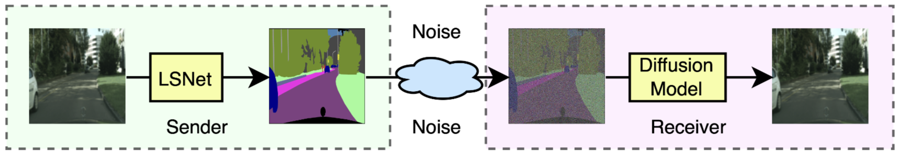
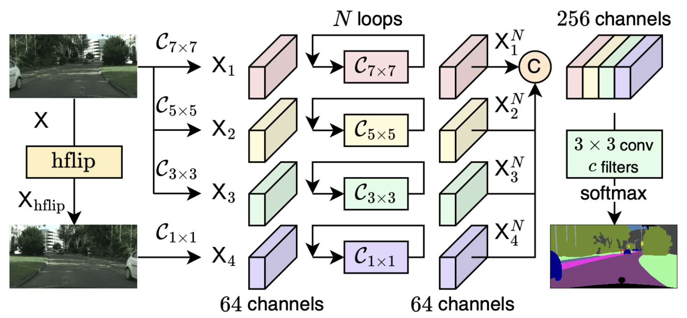
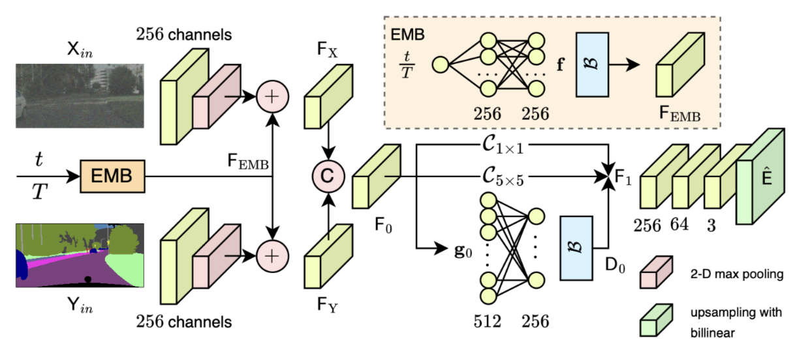

# A Lightweight-to-Diffusion Framework for Semantic Image Communications

With the rapid growth of visual data transmission in bandwidth-limited communication systems, semantic image communication has emerged as a promising paradigm to transmit task-relevant information instead of raw pixels. In this paper, we propose LDSeCom, a lightweight-to-diffusion semantic communication framework that jointly addresses bandwidth efficiency and reconstruction quality.

At the transmitter, a novel loop-based lightweight segmentation network, LSNet, extracts compact semantic maps with extremely low model complexity. At the receiver, an enhanced diffusion model guided by the proposed Adaptive Feature Modulation Network (AFM-Net) reconstructs high-fidelity images from highly compressed semantic representations.

Experimental results on benchmark datasets demonstrate that LDSeCom achieves competitive semantic accuracy with minimal parameters and significantly improves reconstruction quality under severe bandwidth constraints.

The Python code provided here are included in the version of the paper in ICT Express.

Thien Huynh-The, Toan-Van Nguyenb, Phuong Luu Vo, and Huu-Tai Nguyen, "A Lightweight-to-Diffusion Framework for Semantic Image Communications," in ICT Express, doi: doi.org/10.1016/j.icte.2025.12.013, 2025. [[Link](https://www.sciencedirect.com/science/article/pii/S2405959525002127)]

If there are any errors or topics that need to be discussed, please contact [Huu-Tai Nguyen](https://github.com/HuuTaiNg) via email at n.huutai231@gmail.com.

